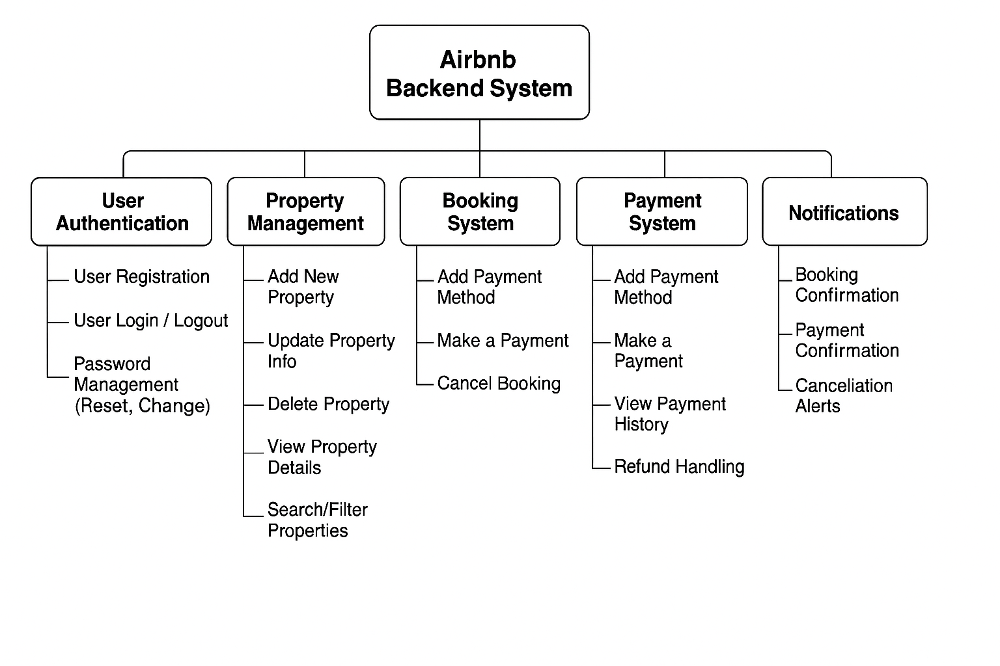

# Airbnb Clone Backend - Features and Functionalities

## Objective
This document outlines the key features and functionalities of the backend system for the Airbnb Clone project. It supports the creation of a scalable, secure, and robust rental platform.

---

## 🧩 Core Functionalities

### 1. User Management
- **User Registration**: Guests and hosts can sign up using email/password or via OAuth (Google, Facebook).
- **Authentication**: Secure login using JWT tokens.
- **Profile Management**: Update profile info, photo, and preferences.

### 2. Property Listings Management
- **Add Listings**: Hosts can add new properties with title, description, location, price, etc.
- **Edit/Delete Listings**: Hosts can update or remove listings.

### 3. Search and Filtering
- Search by location, price, guest capacity, amenities.
- Pagination for handling large property data.

### 4. Booking Management
- **Create Bookings**: Guests book available dates.
- **Booking Validation**: Prevent double bookings.
- **Cancellations**: Guests or hosts can cancel based on policy.
- **Booking Status**: Pending, Confirmed, Cancelled, Completed.

### 5. Payment Integration
- Integration with Stripe or PayPal.
- **Guest Payments**: Upfront.
- **Host Payouts**: After stay completion.
- **Multi-Currency** support.

### 6. Reviews and Ratings
- Guests can review and rate stays.
- Hosts can respond to reviews.
- Reviews tied to completed bookings.

### 7. Notifications System
- Email and in-app alerts for bookings, cancellations, and payments.

### 8. Admin Dashboard
- Manage users, listings, bookings, and payments via a dedicated admin panel.

---

## 🛠️ Technical Requirements

- **Database**: PostgreSQL or MySQL
- **API**: RESTful APIs (GET, POST, PUT, DELETE)
- **Authentication**: JWT & Role-based access (Guests, Hosts, Admins)
- **File Storage**: For profile pictures and listing images (e.g., AWS S3)
- **Email Service**: SendGrid or Mailgun
- **Error Handling**: Global API error handling

---

## 🚀 Non-Functional Requirements

- **Scalability**: Modular architecture, load balancing.
- **Security**: Encrypted data, firewalls, rate limiting.
- **Performance**: Caching (Redis), optimized queries.
- **Testing**: Unit, integration, and automated API tests.

---

## 📊 Visual Overview

---

## ✅ Summary
This backend architecture supports essential features of a rental marketplace, ensuring secure operations, scalability, and a smooth user experience for both guests and hosts.
