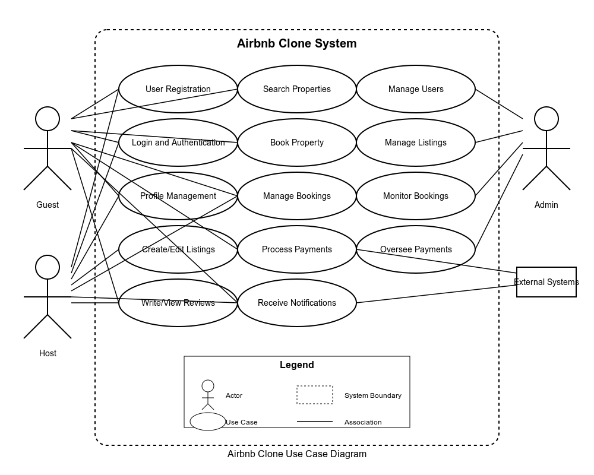

# Airbnb Clone Use Case Diagram

## Overview
This use case diagram represents the core functionalities of the Airbnb Clone system, visualizing the interactions between different users (actors) and the system features.

## Diagram

## Actors
1. **Guest** - Users who search for and book properties
2. **Host** - Users who list and manage properties
3. **Admin** - System administrators who oversee the platform operation
4. **External Systems** - Third-party services like payment gateways and notification systems

## Key Use Cases

### User Management
- **User Registration**: Allows guests and hosts to create accounts
- **Login and Authentication**: Secures user access through credentials verification
- **Profile Management**: Enables users to update personal information and preferences

### Property Management
- **Create/Edit Listings**: Allows hosts to add and modify their property listings

### Search and Booking
- **Search Properties**: Enables guests to find properties based on various criteria
- **Book Property**: Allows guests to reserve properties for specific dates
- **Manage Bookings**: Enables users to view, modify, or cancel bookings

### Payments and Reviews
- **Process Payments**: Handles secure transactions between guests and hosts
- **Write/View Reviews**: Allows users to leave and read property and guest reviews

### Notifications
- **Receive Notifications**: Keeps users informed about booking updates, messages, etc.

### Administrative Functions
- **Manage Users**: Enables admins to oversee user accounts
- **Manage Listings**: Allows admins to monitor and moderate property listings
- **Monitor Bookings**: Provides admins with oversight of booking activities
- **Oversee Payments**: Gives admins visibility into payment transactions

## Relationships
The lines connecting actors to use cases represent the interactions between users and the system features they can access and utilize.